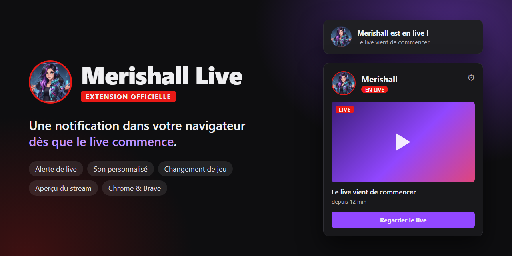

# Merishall Live

**Ne rate plus aucun live de Merishall.**

L'extension officielle Chrome / Brave qui t'envoie une notification
dès que [Merishall](https://www.twitch.tv/merishall) lance son live sur Twitch.

Développée par **[Sliver91](https://github.com/Sliver91)** · [limeris.fr](https://limeris.fr)

 

---

## Ce que fait l'extension

- **Alerte de live** — une notification dans le navigateur dès que le live commence. Un clic dessus ouvre la chaîne.
- **Son personnalisé** — un petit carillon au lancement du live, avec réglage du volume.
- **Changement de jeu** — une notification quand la catégorie change pendant le live.
- **Aperçu du stream** — le popup affiche la miniature du live, son titre, le jeu, le nombre de spectateurs et la durée.
- **Icône qui s'allume** — grisée hors ligne, en couleur avec un badge « LIVE » pendant le direct.
- **Réglages** — chaque notification et le son s'activent ou se coupent séparément, avec un bouton pour tester.

L'extension vérifie la chaîne toutes les minutes, tant que le navigateur est ouvert.

## Installation

L'extension s'installe pour l'instant en mode développeur, sur ordinateur.

1. Clique sur le bouton vert **Code**, en haut de cette page, puis sur **Download ZIP**.
2. Décompresse le zip dans un dossier qui ne bougera plus, par exemple `C:\Merishall Live`.
3. Ouvre `chrome://extensions` (ou `brave://extensions`).
4. Active le **Mode développeur**, en haut à droite.
5. Clique sur **Charger l'extension non empaquetée** et choisis le dossier décompressé, celui qui contient `manifest.json`.
6. Épingle l'extension : icône en forme de pièce de puzzle dans la barre du navigateur, puis l'épingle à côté de « Merishall Live ».

> **Important** — ne déplace pas, ne renomme pas et ne supprime pas ce dossier après l'installation : si le dossier bouge, l'extension disparaît du navigateur.

Si aucune notification n'apparaît, vérifie que les notifications de ton navigateur sont autorisées dans Windows : Paramètres > Système > Notifications.

## Mise à jour

1. Télécharge le nouveau zip et décompresse-le dans le même dossier, en remplaçant les fichiers.
2. Ouvre `chrome://extensions` (ou `brave://extensions`) et clique sur la flèche de rechargement de « Merishall Live ».

Tes réglages sont conservés.

**Plus tard**, l'extension sera publiée sur le Chrome Web Store : l'installation se fera en un clic et les mises à jour seront automatiques.

## Vie privée

- Aucun compte, aucune donnée collectée : tes réglages restent dans ton navigateur.
- L'extension ne contacte que Twitch, pour savoir si le live est en cours. Elle ne lit ni ton historique ni le contenu des pages que tu visites.

## Licence

**Copyright © 2026 Sliver91 — Limeris. Tous droits réservés.**

Ce projet n'est pas open source. Il est interdit de le copier, de le modifier, de le redistribuer ou de le réutiliser, en tout ou en partie, sans l'accord écrit de l'auteur. Voir le fichier [LICENSE](LICENSE).

Merishall Live n'est ni affiliée à Twitch ni approuvée par Twitch.
